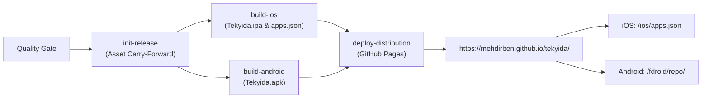

# Mobile App Distribution (iOS & Android)

Tekyida provides automated, direct-to-device app updates through community-standard sideloading and independent repository feeds hosted on **GitHub Pages**:

🌐 **Installation Portal:** [https://mehdirben.github.io/tekyida/](https://mehdirben.github.io/tekyida/)

---

## 📱 iOS Distribution (SideStore, AltStore & LiveContainer)

Tekyida produces unsigned `.ipa` packages compatible with on-device JIT/sideloading runtimes like [SideStore](https://sidestore.io/) and [LiveContainer](https://github.com/khanhduytran0/LiveContainer).

### Source Feed Details
* **Source Feed URL:** `https://mehdirben.github.io/tekyida/ios/apps.json`
* **Direct Add Link:** [Add Source to SideStore](sidestore://source?url=https%3A%2F%2Fmehdirben.github.io%2Ftekyida%2Fios%2Fapps.json)
* **Direct IPA Download:** Available on the [Installation Portal](https://mehdirben.github.io/tekyida/) or via [GitHub Releases](https://github.com/Mehdirben/tekyida/releases).

### How to Install on iOS
1. Open **SideStore** or **AltStore** on your iPhone/iPad.
2. Navigate to **Sources** tab.
3. Tap **+** in the top right corner.
4. Enter `https://mehdirben.github.io/tekyida/ios/apps.json` (or click the 1-click link above from Safari).
5. Tap **Add** — Tekyida will now appear in your browse list and receive automatic update notifications.

---

## 🤖 Android Distribution (F-Droid, Droid-ify & Neo Store)

Tekyida maintains a cryptographically signed F-Droid repository that serves release APKs and repository indices (`index-v1.jar`, `index-v2.json`) directly via HTTP 200 responses.

### Repository Details
* **Repository URL:** `https://mehdirben.github.io/tekyida/fdroid/repo`
* **Direct Add Link:** [Add Repository to F-Droid](fdroidrepo://mehdirben.github.io/tekyida/fdroid/repo?fingerprint=E48D12FB013F44B533153C957BFF75B7702DE74595F6054CBF464F7E64A31DC3)
* **SHA-256 Signing Fingerprint:**
  `E48D12FB013F44B533153C957BFF75B7702DE74595F6054CBF464F7E64A31DC3`
* **Direct APK Download:** `https://mehdirben.github.io/tekyida/fdroid/repo/Tekyida.apk`

### How to Install on Android
1. Open **F-Droid**, **Droid-ify**, or **Neo Store**.
2. Go to **Settings** → **My Repositories** (or **Repositories**).
3. Tap the **+** (Add) icon.
4. Enter the repository URL: `https://mehdirben.github.io/tekyida/fdroid/repo`.
5. If prompted, verify the fingerprint matches `E48D12FB013F44B533153C957BFF75B7702DE74595F6054CBF464F7E64A31DC3`.
6. Sync/update repositories, then search for **Tekyida** and install.

---

## ⚙️ CI/CD Automation & Architecture

The distribution pipeline is integrated into [.github/workflows/build.yml](file:///home/mehdi/projects/tekyida/.github/workflows/build.yml):

### Key Workflow Highlights
1. **Dynamic Build Number Sync:** Every run synchronizes the iOS `CFBundleVersion` and Android `versionCode` to `${{ github.run_number }}` so update detection triggers reliably.
2. **Deterministic Signing:** The repository index is signed with a stable PKCS12 keystore (`distribution/fdroid/keystore.p12`), ensuring existing installations never suffer certificate mismatch errors.
3. **Sensitive Key Stripping:** Keystores and private configs are utilized during build time to generate signed `index-v1.jar` and `index-v2.json`, and are removed prior to deploying the static site to GitHub Pages.
