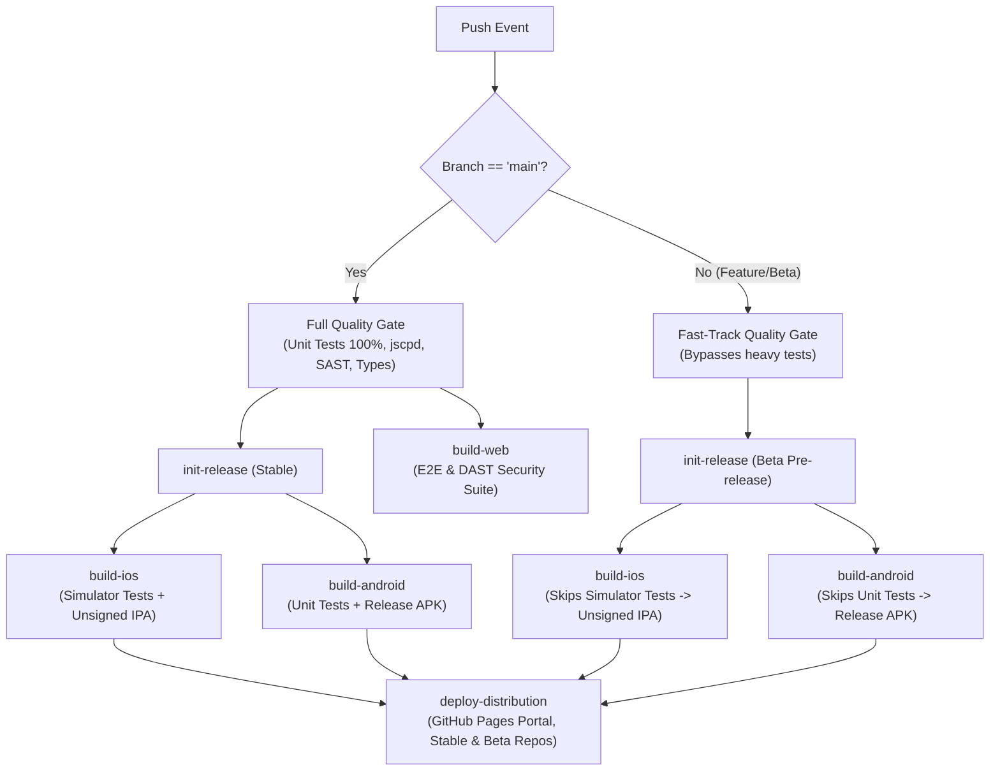

# Mobile App Distribution (iOS & Android)

Tekyida provides automated, direct-to-device app updates through community-standard sideloading and independent repository feeds hosted on **GitHub Pages**, with dedicated **Stable** and **Beta** channels:

🌐 **Installation Portal:** [https://mehdirben.github.io/tekyida/](https://mehdirben.github.io/tekyida/)

---

## 📱 iOS Distribution (SideStore, AltStore & LiveContainer)

Tekyida produces unsigned `.ipa` packages compatible with on-device JIT/sideloading runtimes like [SideStore](https://sidestore.io/) and [LiveContainer](https://github.com/khanhduytran0/LiveContainer).

### Source Feeds
* **Stable Feed URL:** `https://mehdirben.github.io/tekyida/ios/apps.json`
* **Beta Feed URL:** `https://mehdirben.github.io/tekyida/ios/beta/apps.json`
* **Direct Add Link (Stable):** [Add Stable to SideStore](sidestore://source?url=https%3A%2F%2Fmehdirben.github.io%2Ftekyida%2Fios%2Fapps.json)
* **Direct Add Link (Beta):** [Add Beta to SideStore](sidestore://source?url=https%3A%2F%2Fmehdirben.github.io%2Ftekyida%2Fios%2Fbeta%2Fapps.json)
* **Direct IPA Download:** Available on the [Installation Portal](https://mehdirben.github.io/tekyida/) or via [GitHub Releases](https://github.com/Mehdirben/tekyida/releases).

### How to Install on iOS
1. Open **SideStore** or **AltStore** on your iPhone/iPad.
2. Navigate to **Sources** tab.
3. Tap **+** in the top right corner.
4. Enter either the Stable or Beta URL (or click the 1-click link above from Safari).
5. Tap **Add** — Tekyida will now appear in your browse list and receive automatic update notifications.

---

## 🤖 Android Distribution (F-Droid, Droid-ify & Neo Store)

Tekyida maintains cryptographically signed F-Droid repositories that serve release APKs and repository indices (`index-v1.jar`, `index-v2.json`) directly via HTTP 200 responses.

### Repositories
* **Stable Repo URL:** `https://mehdirben.github.io/tekyida/fdroid/repo`
* **Beta Repo URL:** `https://mehdirben.github.io/tekyida/fdroid/beta/repo`
* **Direct Add Link (Stable):** [Add Stable to F-Droid](fdroidrepo://mehdirben.github.io/tekyida/fdroid/repo?fingerprint=E48D12FB013F44B533153C957BFF75B7702DE74595F6054CBF464F7E64A31DC3)
* **Direct Add Link (Beta):** [Add Beta to F-Droid](fdroidrepo://mehdirben.github.io/tekyida/fdroid/beta/repo?fingerprint=E48D12FB013F44B533153C957BFF75B7702DE74595F6054CBF464F7E64A31DC3)
* **SHA-256 Signing Fingerprint (Shared across Stable & Beta):**
  `E48D12FB013F44B533153C957BFF75B7702DE74595F6054CBF464F7E64A31DC3`
* **Direct APK Download:**
  - Stable: `https://mehdirben.github.io/tekyida/fdroid/repo/Tekyida.apk`
  - Beta: `https://mehdirben.github.io/tekyida/fdroid/beta/repo/Tekyida.apk`

### How to Install on Android
1. Open **F-Droid**, **Droid-ify**, or **Neo Store**.
2. Go to **Settings** → **My Repositories** (or **Repositories**).
3. Tap the **+** (Add) icon.
4. Enter either repository URL (`/fdroid/repo` for Stable or `/fdroid/beta/repo` for Beta).
5. If prompted, verify the fingerprint matches `E48D12FB013F44B533153C957BFF75B7702DE74595F6054CBF464F7E64A31DC3`.
6. Sync/update repositories, then search for **Tekyida** and install.

---

## ⚙️ CI/CD Automation & Architecture

The distribution pipeline is integrated into [.github/workflows/build.yml](file:///home/mehdi/projects/tekyida/.github/workflows/build.yml):

### Key Workflow Highlights
1. **Branch-Aware Test Execution:** Pushes to `main` undergo full quality enforcement (100% coverage, SAST, E2E, DAST, iOS simulator, and Android tests). Non-main branches fast-track compilation of IPA and APK without blocking on heavy tests.
2. **Dual-Channel GitHub Releases:** Commits on `main` generate official Releases (`build-<N>`), while feature/beta branches generate pre-releases (`beta-<N>`).
3. **Dual-Channel Distribution on GitHub Pages:** Both Stable and Beta feeds (`/ios/apps.json`, `/ios/beta/apps.json`, `/fdroid/repo/`, `/fdroid/beta/repo/`) are updated and maintained concurrently.
4. **App Metadata & Icon Resolution:** App icons are published via standard Fastlane structure (`metadata/com.tekyida/en-US/images/icon.png`) ensuring clean single-app presentation in F-Droid clients without phantom icon packages.
5. **Deterministic Signing & Security:** Both F-Droid repositories are signed with `distribution/fdroid/keystore.p12`. Keystores and private configs are removed prior to deploying the static site to GitHub Pages.
