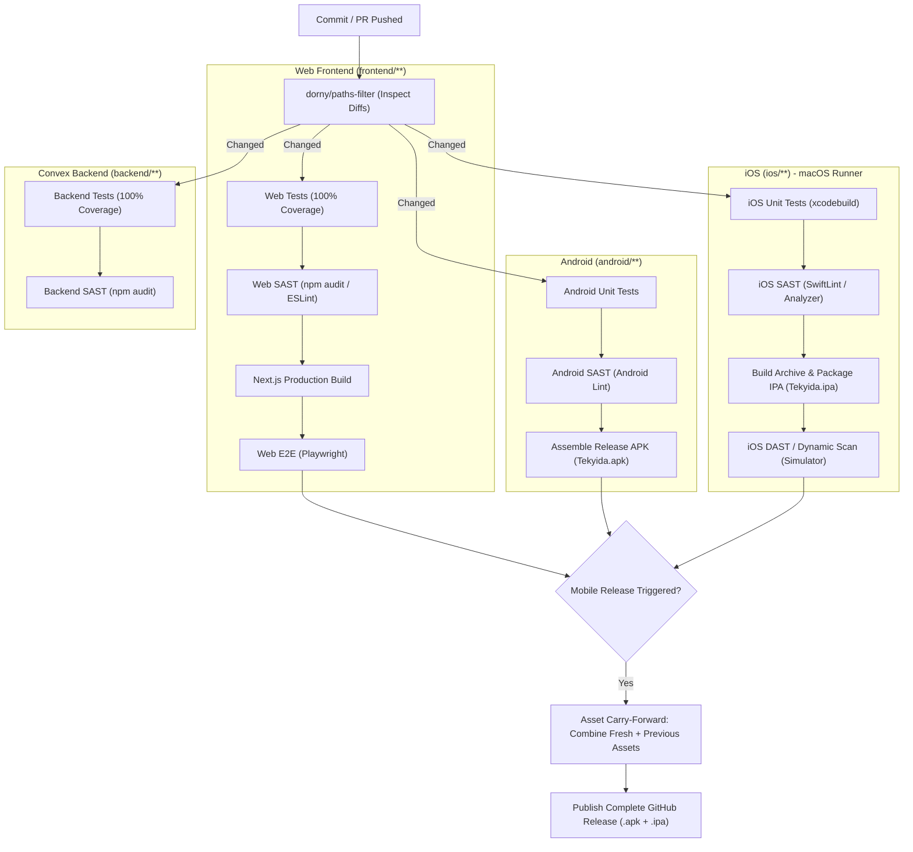
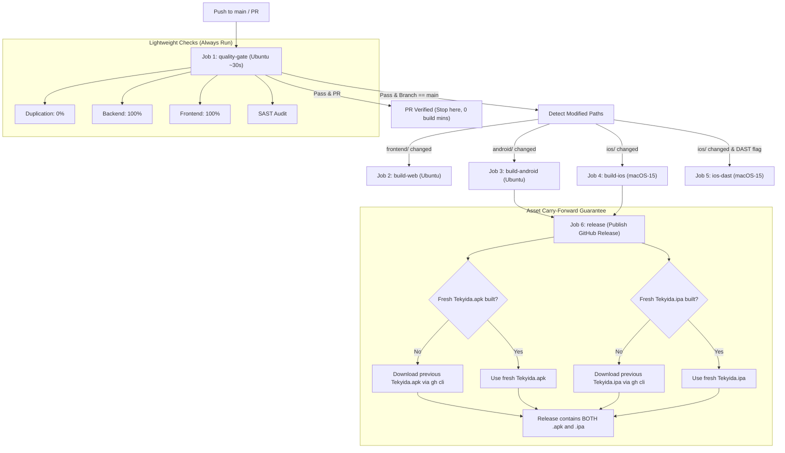

# Quality, Security & Build Pipeline Architecture Plan

This document outlines the testing (Unit & E2E), security analysis (SAST & DAST), and CI/CD workflow architecture for Tekyida across all four targets: **Convex Backend**, **Next.js Web Frontend**, **Android (Kotlin/Compose)**, and **iOS (SwiftUI)**.

---

## 1. Core Architectural Principles

1. **Strict Change-Driven Execution ("No Changes $\rightarrow$ No Run")**:
   - If files in a platform's folder did not change, **skip all its heavy builds, E2E tests, SAST audits, and DAST scans**.
   - Zero wasted developer time locally; zero wasted compute/macOS minutes in CI.
2. **Guaranteed Dual-Asset Releases ("Asset Carry-Forward")**:
   - Every GitHub Release **always contains both `Tekyida.apk` and `Tekyida.ipa`**.
   - If only Android changed, the new `.apk` is bundled with the carried-forward `.ipa` from the previous release.
   - If only iOS changed, the new `.ipa` is bundled with the carried-forward `.apk` from the previous release.
3. **Two-Tier Script Model (Quick vs. Full)**:
   - `tests/run.sh`: Lightning-fast developer guardrail (~8–10s) with 0% duplication, 100% coverage, and quick SAST.
   - `tests/full.sh`: Deep production compilation, mobile packaging, and E2E verification.
4. **OS Auto-Detection**:
   - Local scripts detect whether they are running on Linux or macOS. Native iOS tasks execute on macOS and log a clean informational skip on Linux without failing.

---

## 2. Platform Change-Detection Matrix



---

## 3. Testing & Security Taxonomy Across All Targets

| Target | Unit Tests & Coverage | SAST (Static Security) | E2E (End-to-End) | DAST (Dynamic Security) | Skip Condition |
| :--- | :--- | :--- | :--- | :--- | :--- |
| **Web Frontend** | `vitest` (100% Coverage) | `npm audit` + ESLint Security | Playwright (Headless Chrome/Firefox) | OWASP ZAP (Web API attack) | No changes in `frontend/**` |
| **Convex Backend** | `vitest` + `convex-test` (100% Coverage) | `npm audit` + Schema rules | Tested via Web Frontend E2E | Specialized RPC security fuzzing | No changes in `backend/**` |
| **Android** | JUnit & Compose Tests | Android Lint / Gradle Check | Maestro / Espresso (Emulator) | MobSF static/dynamic Android check | No changes in `android/**` |
| **iOS** | `xcodebuild test` (XCTest) | SwiftLint / Xcode Analyzer | Maestro / XCUITest (Simulator) | MobSF Dynamic / OWASP ZAP Proxy (macOS Simulator) | No changes in `ios/**` |

---

## 4. Local Scripts Architecture (`tests/`)

### 4.1. Quick Suite: `tests/run.sh` (~8–10 Seconds)
Meant to run continuously during development.

```
========================================================================
                   TEKYIDA QUALITY & TEST DASHBOARD                     
========================================================================
 Check                 | Target / Threshold | Actual Result     | Status 
-----------------------+--------------------+-------------------+--------
 Code Duplication      | 0.00% (0 clones)   | 0.00% (0 clones)  | PASSED 
 Docs Ignored in JSCPD | Markdown/Docs Excl | Excluded (0 files)| PASSED 
-----------------------+--------------------+-------------------+--------
 Backend Statements    | 100.00%            | 100.00%           | PASSED 
 Backend Lines         | 100.00%            | 100.00%           | PASSED 
 Backend Functions     | 100.00%            | 100.00%           | PASSED 
 Backend Branches      | 100.00%            | 100.00%           | PASSED 
-----------------------+--------------------+-------------------+--------
 Frontend Statements   | 100.00%            | 100.00%           | PASSED 
 Frontend Lines        | 100.00%            | 100.00%           | PASSED 
 Frontend Functions    | 100.00%            | 100.00%           | PASSED 
 Frontend Branches     | 100.00%            | 100.00%           | PASSED 
-----------------------+--------------------+-------------------+--------
 SAST Security Audit   | 0 High/Critical    | 0 Vulnerabilities | PASSED 
 TypeScript Integrity  | 0 Type Errors      | Clean (0 errors)  | PASSED 
-----------------------+--------------------+-------------------+--------
 iOS Unit Tests        | macOS Xcode Suite  | Linux: Skipped    | READY  
========================================================================
```

### 4.2. Full Pipeline Suite: `tests/full.sh` (~2–3 Minutes)
Performs real compilations and E2E validations:
1. Runs `./tests/run.sh`.
2. Compiles Next.js production build (`npm run build --prefix frontend`).
3. Compiles Android release APK (`cd android && ./gradlew assembleRelease`).
4. Checks OS environment:
   - If on macOS: Runs `xcodegen generate` and compiles iOS archive (`xcodebuild`).
   - If on Linux: Logs `ℹ Non-macOS environment detected ($(uname -s)). Skipping native iOS build.` and continues.
5. Runs Web E2E smoke tests.

---

## 5. GitHub Actions CI/CD (`.github/workflows/build.yml`)

### 5.1. Execution Flow & Job Dependencies



### 5.2. Concrete Carry-Forward Script in `release` Job
```bash
mkdir -p release-assets

# Resolve Android APK
if [ -f "android-artifact/Tekyida.apk" ]; then
  echo "✓ Using freshly compiled Android APK."
  cp android-artifact/Tekyida.apk release-assets/
else
  echo "ℹ Android was not modified. Carrying forward latest APK from previous release..."
  gh release download --pattern "Tekyida.apk" --dir release-assets/ || true
fi

# Resolve iOS IPA
if [ -f "ios-artifact/Tekyida.ipa" ]; then
  echo "✓ Using freshly compiled iOS IPA."
  cp ios-artifact/Tekyida.ipa release-assets/
  [ -f "ios-artifact/apps.json" ] && cp ios-artifact/apps.json release-assets/
else
  echo "ℹ iOS was not modified. Carrying forward latest IPA from previous release..."
  gh release download --pattern "Tekyida.ipa" --pattern "apps.json" --dir release-assets/ || true
fi

# Publish guaranteed dual-asset release
gh release create "build-${{ github.run_number }}" release-assets/* \
  --title "Tekyida Build ${{ github.run_number }}" \
  --notes "Automated build from commit ${{ github.sha }}."
```

---

## 6. Implementation Checklist

- [ ] **Phase 1: Update `tests/run.sh` (Quick Suite)**
  - Add SAST dependency audit (`npm audit --audit-level=high` for backend and frontend).
  - Add TypeScript check (`tsc --noEmit`).
  - Add OS detection block for iOS unit test check (`darwin` vs `linux`).
  - Update Dashboard output table with SAST status.
- [ ] **Phase 2: Create `tests/full.sh` (Full Pipeline Suite)**
  - Execute `tests/run.sh` first.
  - Compile Next.js production build (`npm run build --prefix frontend`).
  - Compile Android Release APK (`cd android && ./gradlew assembleRelease`).
  - Add iOS OS auto-detection (executes on macOS, logs graceful skip on Linux).
  - Web E2E smoke tests.
- [ ] **Phase 3: Update `.github/workflows/build.yml`**
  - Add `quality-gate` job as prerequisite (`needs: [ quality-gate ]`).
  - Add path filtering (`dorny/paths-filter`) to conditionally trigger:
    - `build-android` only when `android/**` or `backend/**` change.
    - `build-ios` and `ios-dast` only when `ios/**` or `backend/**` change.
    - `build-web` only when `frontend/**` or `backend/**` change.
  - Implement Asset Carry-Forward in `release` job using `gh release download` so every release has both `Tekyida.apk` and `Tekyida.ipa`.
