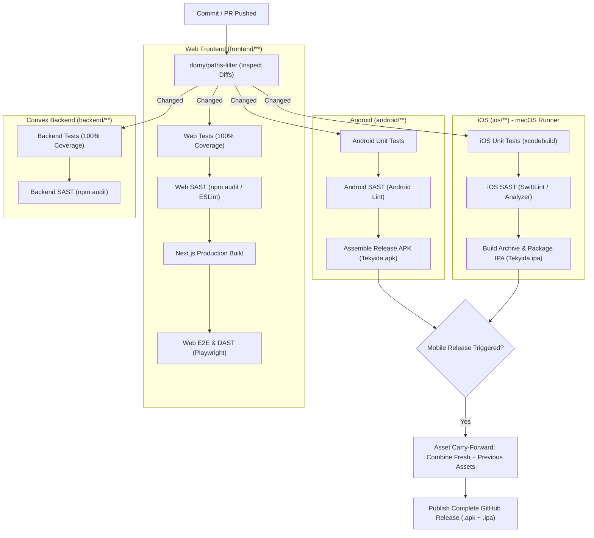
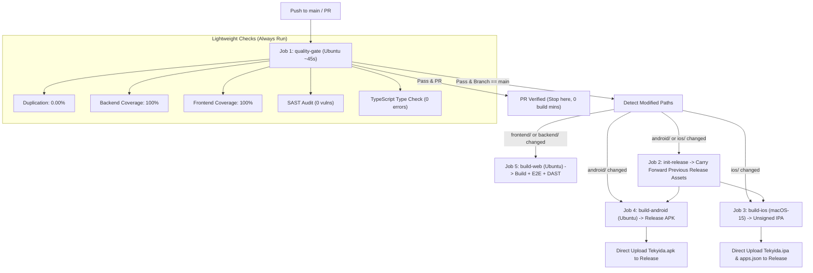

# Quality, Security & Build Pipeline Architecture Plan

This document outlines the testing (Unit & E2E), security analysis (SAST & DAST), and CI/CD workflow architecture for Tekyida across all four targets: **Convex Backend**, **Next.js Web Frontend**, **Android (Kotlin/Compose)**, and **iOS (SwiftUI)**.

---

## 1. Core Architectural Principles

1. **Strict Change-Driven Execution ("No Changes $\rightarrow$ No Run")**:
   - If files in a platform's folder did not change, **skip all its heavy builds, E2E tests, SAST audits, and DAST scans**.
   - Zero wasted developer time locally; zero wasted compute/macOS minutes in CI.
2. **Guaranteed Dual-Asset Releases ("Asset Carry-Forward")**:
   - Every GitHub Release **always contains both `Tekyida.apk` and `Tekyida.ipa`**.
   - If only Android changed, the new `.apk` is bundled with the carried-forward `.ipa` from the previous release.
   - If only iOS changed, the new `.ipa` is bundled with the carried-forward `.apk` from the previous release.
   - Assets are uploaded directly to GitHub Releases, requiring **0 MB of GitHub Actions artifact storage**.
3. **Two-Tier Script Model (Quick vs. Full)**:
   - `tests/run.sh`: Lightning-fast developer guardrail (~8–10s) with 0% duplication, 100% coverage, and quick SAST.
   - `tests/full.sh`: Deep production compilation, mobile packaging, Playwright Web E2E, and DAST dynamic security audit.
4. **OS Auto-Detection**:
   - Local scripts detect whether they are running on Linux or macOS. Native iOS tasks execute on macOS and log a clean informational skip on Linux without failing.

---

## 2. Platform Change-Detection Matrix



---

## 3. Testing & Security Taxonomy Across All Targets

| Target | Unit Tests & Coverage | SAST (Static Security) | E2E (End-to-End) | DAST (Dynamic Security) | Skip Condition |
| :--- | :--- | :--- | :--- | :--- | :--- |
| **Web Frontend** | `vitest` (100% Coverage) | `npm audit` + ESLint Security | Playwright (Headless Chromium) | Playwright DAST Suite (Headers, Traversal, Fuzzing, XSS/SQLi) | No changes in `frontend/**` |
| **Convex Backend** | `vitest` + `convex-test` (100% Coverage) | `npm audit` + Schema rules | Tested via Web Frontend E2E | Fuzzing & Auth Boundary Validation | No changes in `backend/**` |
| **Android** | JUnit (`TekyidaUnitTest.kt`) | Android Lint / Gradle Check | Unit/Component Logic Validated | `AndroidSecurityTest.kt` (Cleartext, Manifest, Permissions) | No changes in `android/**` |
| **iOS** | XCTest (`TekyidaTests.swift`) | SwiftLint / Xcode Analyzer | XCUITest (`TekyidaUITests.swift`) | `TekyidaTests.swift` (App Transport Security ATS Check) | No changes in `ios/**` |

---

## 4. Local Scripts Architecture (`tests/`)

### 4.1. Quick Suite: `tests/run.sh` (~8–10 Seconds)
Meant to run continuously during development.

```
========================================================================
                   TEKYIDA QUALITY & TEST DASHBOARD                     
========================================================================
 Check                 | Target / Threshold | Actual Result     | Status 
-----------------------+--------------------+-------------------+--------
 Code Duplication      | 0.00% (0 clones)   | 0.00% (0 clones)  | PASSED 
 Docs Ignored in JSCPD | Markdown/Docs Excl | Excluded (0 files)| PASSED 
-----------------------+--------------------+-------------------+--------
 Backend Statements    | 100.00%            | 100.00%           | PASSED 
 Backend Lines         | 100.00%            | 100.00%           | PASSED 
 Backend Functions     | 100.00%            | 100.00%           | PASSED 
 Backend Branches      | 100.00%            | 100.00%           | PASSED 
-----------------------+--------------------+-------------------+--------
 Frontend Statements   | 100.00%            | 100.00%           | PASSED 
 Frontend Lines        | 100.00%            | 100.00%           | PASSED 
 Frontend Functions    | 100.00%            | 100.00%           | PASSED 
 Frontend Branches     | 100.00%            | 100.00%           | PASSED 
-----------------------+--------------------+-------------------+--------
 SAST Security Audit   | 0 High/Critical    | 0 Vulnerabilities | PASSED 
 TypeScript Integrity  | 0 Type Errors      | Clean (0 errors)  | PASSED 
-----------------------+--------------------+-------------------+--------
 Android Unit & Sec    | JUnit Test Suite   | 5 Tests Passed    | PASSED 
 iOS Unit & UI Tests   | Xcode Test Suite   | Configured        | READY  
========================================================================
```

### 4.2. Full Pipeline Suite: `tests/full.sh` (~2–3 Minutes)
Performs real compilations and E2E validations:
1. Runs `./tests/run.sh`.
2. Compiles Next.js production build (`npm run build --prefix frontend`).
3. Runs Web E2E (Playwright) & DAST Dynamic Security Verification (`frontend/e2e/`).
4. Compiles Android release APK (`cd android && ./gradlew assembleRelease`).
5. Checks OS environment:
   - If on macOS: Runs `xcodegen generate` and compiles iOS archive (`xcodebuild`).
   - If on Linux: Logs `ℹ Non-macOS environment detected ($(uname -s)). Skipping native iOS build.` and continues.
6. Verifies Web Production Manifest & standalone assets.

---

## 5. GitHub Actions CI/CD (`.github/workflows/build.yml`)

### 5.1. Execution Flow & Job Dependencies



---

## 6. Implementation Checklist

- [x] **Phase 1: Update `tests/run.sh` (Quick Suite)**
  - [x] Add SAST dependency audit (`npm audit --audit-level=high` for backend and frontend).
  - [x] Add TypeScript check (`tsc --noEmit`).
  - [x] Add OS detection block for iOS unit test check (`darwin` vs `linux`).
  - [x] Update Dashboard output table with SAST status.
- [x] **Phase 2: Create `tests/full.sh` (Full Pipeline Suite)**
  - [x] Execute `tests/run.sh` first.
  - [x] Compile Next.js production build (`npm run build --prefix frontend`).
  - [x] Compile Android Release APK (`cd android && ./gradlew assembleRelease`).
  - [x] Add iOS OS auto-detection (executes on macOS, logs graceful skip on Linux).
  - [x] Add Web E2E and DAST Dynamic Security Verification.
- [x] **Phase 3: Update `.github/workflows/build.yml`**
  - [x] Add `quality-gate` job as prerequisite (`needs: [ quality-gate ]`).
  - [x] Add path filtering (`dorny/paths-filter`) to conditionally trigger:
    - [x] `build-android` only when `android/**` changes.
    - [x] `build-ios` only when `ios/**` changes.
    - [x] `build-web` only when `frontend/**` or `backend/**` changes.
  - [x] Implement Asset Carry-Forward in `init-release` job using `gh release download` so every release has both `Tekyida.apk` and `Tekyida.ipa`.
  - [x] Remove GitHub Actions artifact storage; upload directly to GitHub Releases.
- [x] **Phase 4: Web E2E & DAST Dynamic Application Security Testing**
  - [x] Setup Playwright in `frontend/`.
  - [x] E2E test suites: Landing page, authentication flows (login, register, reset-password), PWA manifest & service worker.
  - [x] DAST dynamic security suite: Security headers (X-Frame-Options, X-Content-Type-Options, Referrer-Policy, Permissions-Policy), sensitive path probe & traversal resistance, HTTP TRACE denial, XSS & SQLi payload fuzzing (graceful non-500 responses without stack traces), open redirect resistance.
  - [x] Add Next.js HTTP security headers in `frontend/next.config.ts`.
  - [x] Integrated into `tests/full.sh` and GitHub Actions `build-web` job.
- [x] **Phase 5: Android & iOS Unit, E2E & DAST Dynamic Security Testing**
  - [x] Android Unit Tests (`android/app/src/test/java/com/tekyida/TekyidaUnitTest.kt`): pure functions for greeting, debt balance calculations, settlement rules.
  - [x] Android Security & DAST Check (`android/app/src/test/java/com/tekyida/AndroidSecurityTest.kt`): cleartext traffic disabled, manifest structure, least privilege permission footprint.
  - [x] iOS UI E2E Test Suite (`ios/Tests/TekyidaUITests/TekyidaUITests.swift`): automated UI navigation and interaction with `XCUIApplication()`.
  - [x] iOS DAST Security Check (`ios/Tests/TekyidaTests/TekyidaTests.swift`): App Transport Security (ATS) enforcement (`NSAllowsArbitraryLoads` rejection).
  - [x] Integrated into `tests/run.sh`, `tests/full.sh`, and GitHub Actions CI workflow (`build-android` and `build-ios` on macOS-15 runner).
